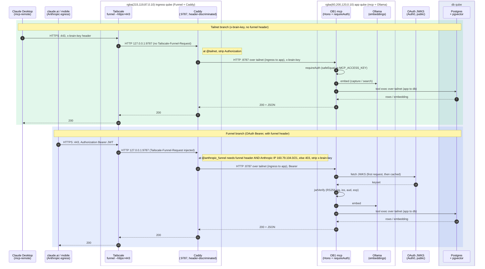

# Open Brain — Self-Hosted

Self-hosted [Open Brain (OB1)](https://github.com/NateBJones-Projects/OB1): a persistent AI memory layer — Postgres + pgvector storage, local embeddings, one MCP server — that any MCP-aware AI client can read and write. No Supabase, no cloud, $0/month, your data never leaves hardware you own.

This repo is one codebase with **three install paths**, from "docker on a laptop" to "compartmentalized Qubes OS deployment with a hardened public edge":

| Install path | What you get | Start here |
|---|---|---|
| **Local compose** | Postgres + MCP server + Ollama on one box, loopback-only, shared-key auth. Runs anywhere Docker runs — including a work machine. | [`deploy/compose-local/`](deploy/compose-local/README.md) |
| **Tailnet / Funnel** | The same stack reachable from every device in your tailnet (`tailscale serve`), and optionally from claude.ai and Claude mobile over the public internet via Tailscale Funnel + Caddy + OAuth (RS256) + an Anthropic egress IP allowlist. | [`deploy/compose-tailnet/`](deploy/compose-tailnet/README.md) |
| **Qubes OS** | The stack inside a Qubes app qube, with the persistence and SELinux gotchas solved, plus a design for splitting ingress / app / database into separate qubes. | [`deploy/qubes/`](deploy/qubes/README.md) |

## What's in the box

- **`thoughts` memory** — capture, semantic search, listing, stats over a pgvector store. Dedupe by content fingerprint. Optional LLM metadata extraction (topics, people, action items, type) via any OpenAI-compatible endpoint.
- **Session tracking** — five additional MCP tools (`session_capture`, `session_resume`, `session_search`, `session_list`, `session_update_status`) that store structured *agent work sessions* alongside (not inside) `thoughts`. The canonical artifact is a TOML front-matter file; the database is a derived index. See [`skills/session-tracker/`](skills/session-tracker/SKILL.md) for the agent-facing usage contract.
- **Local embeddings** — Ollama (`nomic-embed-text`, 768-dim by default), in-stack or on another box.
- **Two auth doors** — a static `x-brain-key` header for tailnet clients, and OAuth 2.1 resource-server validation (RS256 JWT via JWKS) for the public Funnel path. Every write is stamped server-side with the door it came through.
- **Observability** — Caddy JSON access logs, an auth-failure audit table, a log-ingester sidecar, and a daily rollup with retention, so a public endpoint is *measured*, not guessed at.
- **Defense in depth** — loopback-only binds, dropped capabilities, read-only rootfs, least-privilege DB roles with a drift assertion, header-strip boundaries at the proxy, fail-fast misconfiguration guards. The full inventory is in [`docs/security-model.md`](docs/security-model.md).

## Architecture

Pattern A (tailnet-only) runs postgres + mcp + ollama and fronts the MCP server directly with `tailscale serve`. Pattern B adds Caddy and Tailscale Funnel for public access. Both patterns converge on the same backend; Caddy's single `:9787` listener discriminates tailnet vs Funnel traffic via the `Tailscale-Funnel-Request` header that Tailscale injects only on funnel-originated requests (we call this single-listener design **Pattern Y** throughout the repo).

On the [Qubes install path](deploy/qubes/README.md) these roles are split across **three qubes** — a Funnel + Caddy **ingress** qube, an **app** qube (mcp + Ollama), and a **db** qube (Postgres) — reached over a firewall-scoped tailnet ([three-qube-design.md](deploy/qubes/three-qube-design.md)) so that a compromised public edge need not expose the memory store, which lives in its own db qube. The sequence below shows that topology; on a single host the same flow runs over the local docker network.



## Repository layout

```
.
├── server/                    Deno + Hono MCP server (11 tools), unit tests,
│                              Dockerfiles for mcp and the log-ingester sidecar
├── db/                        Postgres init: roles, pgvector schema, observability,
│                              grants-drift assertion, sessions schema, daily rollup
├── deploy/
│   ├── compose-local/         Install path 1 — base docker-compose.yml + .env.example
│   ├── compose-tailnet/       Install path 2 — Pattern B overlay, Caddyfile, caddy image
│   └── qubes/                 Install path 3 — Qubes runbook + three-qube design doc
├── scripts/                   Daily observability summary, existing-deployment upgrades
├── skills/session-tracker/    Agent-facing skill: how to use the session_* tools
├── docs/                      Security model, Funnel-as-MCP-perimeter guide
└── .github/workflows/         CI (deno tests, --allow-env drift guard) + leak gate
```

The `queries.ts` / `mcp-server.ts` / `index.ts` split keeps all SQL in a pure, reusable module — a REST gateway, CLI, or dashboard could be added without rewriting database code.

## Quickstart

The five-minute version (full guide in [`deploy/compose-local/`](deploy/compose-local/README.md)):

```bash
git clone https://github.com/lcjanke2020/ob1-selfhosted.git
cd ob1-selfhosted/deploy/compose-local
cp .env.example .env       # then fill in the four secrets (openssl rand -hex 24/32)
docker compose up -d ollama
docker compose exec ollama ollama pull nomic-embed-text
docker compose up -d
curl http://127.0.0.1:8787/health
```

Then point any MCP client at `http://127.0.0.1:8787/mcp` with your `x-brain-key`.

## Trust model, in one paragraph

Anyone who can present your `x-brain-key` from inside the perimeter (loopback, or your tailnet ACLs in the tailnet install) gets full read/write to your memory store — treat the key like a database password. On the Funnel path, anyone on the public internet with a valid RS256 JWT from your OAuth tenant gets the same — identity rests on your tenant's user management, and an IP allowlist restricts the door to Anthropic's published egress range before auth is even attempted. There is no per-user row-level security yet; the JWT `sub` is recorded on every write but is informational. The longer version, including what each container is allowed to do after a hypothetical compromise, is in [`docs/security-model.md`](docs/security-model.md).

## Status & roadmap

- All three install paths describe deployments that are running today; the test suite (`cd server && deno task test`) is hermetic and runs in CI.
- The Qubes install path runs as the **three-qube split**: Postgres in its own db qube, the app (mcp + Ollama) in an app qube, and Funnel + Caddy in an ingress qube that reverse-proxies to the app qube across a firewall-scoped tailnet ([`deploy/qubes/three-qube-design.md`](deploy/qubes/three-qube-design.md)). Two edge-hardening cleanups remain tracked: parking the ingress qube's unused app containers ([#13](https://github.com/lcjanke2020/ob1-selfhosted/issues/13)) and finalizing log-ingester placement ([#12](https://github.com/lcjanke2020/ob1-selfhosted/issues/12)).

## License & attribution

This project is a self-hosted derivative of [Open Brain](https://github.com/NateBJones-Projects/OB1) by Nate B. Jones, developed against the [OB1-homelab](https://github.com/openbrain-build/OB1-homelab) line. It is licensed under the same **FSL-1.1-MIT** terms (see [LICENSE.md](LICENSE.md)) — free for any non-competing use, converting to MIT two years after release. The `thoughts` table layout stays compatible with upstream OB1 so schema extensions from that community work here too.
