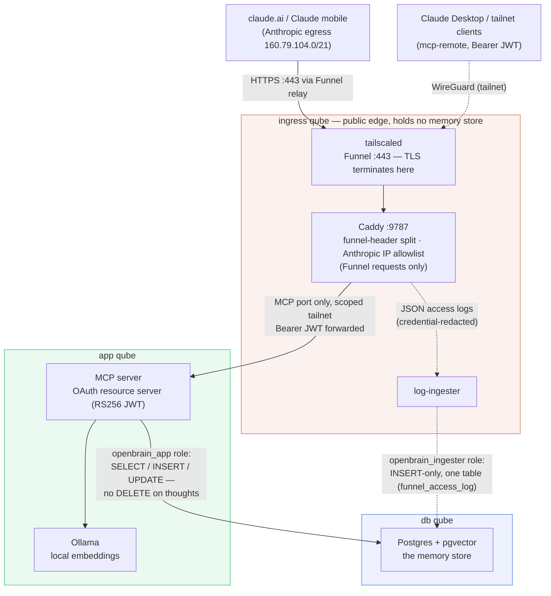
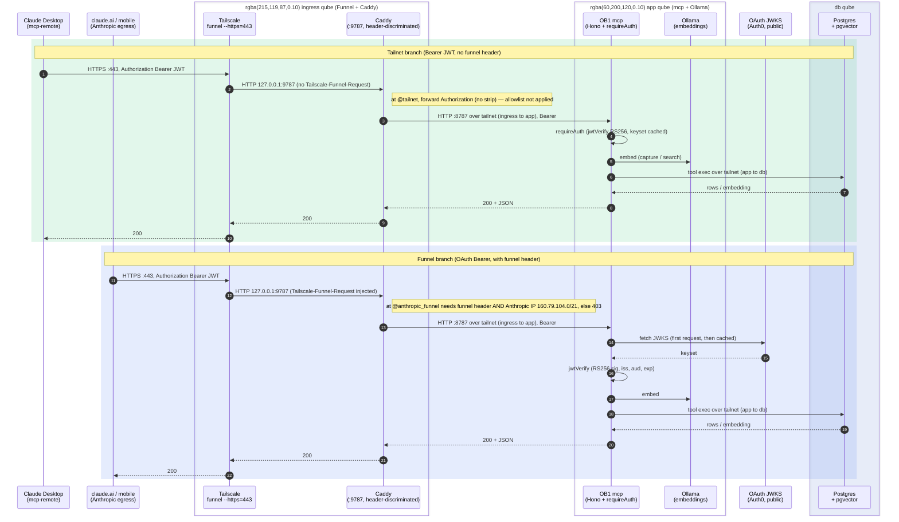
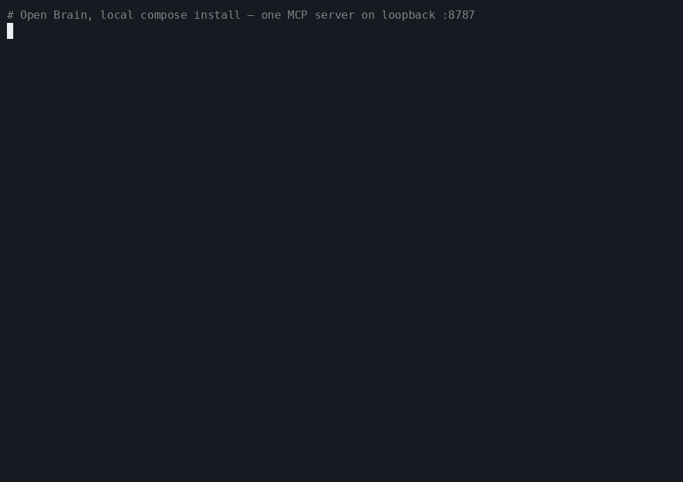
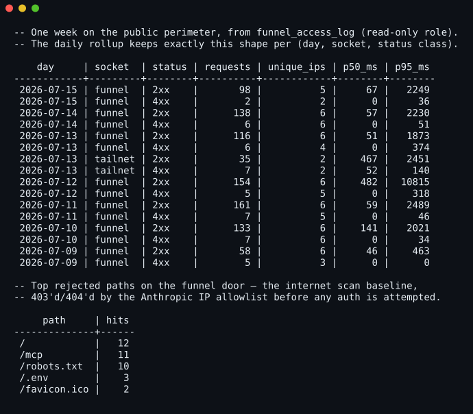

# Open Brain — Self-Hosted

[](https://github.com/lcjanke2020/ob1-selfhosted/actions/workflows/ci.yml)
[](https://github.com/lcjanke2020/ob1-selfhosted/actions/workflows/leak-gate.yml)
[](https://github.com/lcjanke2020/ob1-selfhosted/actions/workflows/allowlist-guard.yml)
[](https://github.com/lcjanke2020/ob1-selfhosted/actions/workflows/caddy-validate.yml)
[](https://github.com/lcjanke2020/ob1-selfhosted/actions/workflows/db-init.yml)

Self-hosted [Open Brain (OB1)](https://github.com/NateBJones-Projects/OB1): a persistent AI memory layer — Postgres + pgvector storage, local embeddings, one MCP server — that any MCP-aware AI client can read and write. No Supabase, no cloud, $0/month, your data never leaves hardware you own.

This repo is one codebase with **three install paths**, from "docker on a laptop" to "compartmentalized Qubes OS deployment with a hardened public edge":

| Install path | What you get | Start here |
|---|---|---|
| **Local compose** | Postgres + MCP server + Ollama on one box (bound to loopback only by default — the LAN can't reach it directly), simple shared `x-brain-key` auth (no Auth0 tenant needed). Runs anywhere Docker runs — including a work machine where a tailnet or hosted IdP isn't practical. | [`deploy/compose-local/`](deploy/compose-local/README.md) |
| **Tailnet / Funnel** | The same stack exposed to claude.ai and Claude mobile over the public internet via Tailscale Funnel + Caddy + OAuth (RS256 JWT) + an Anthropic egress IP allowlist. **OAuth is the only auth door** here — no static key on the public edge. | [`deploy/compose-tailnet/`](deploy/compose-tailnet/README.md) |
| **Qubes OS** | The stack split across ingress / app / database qubes, with the persistence and SELinux gotchas solved. Also OAuth-only, like the Funnel path. | [`deploy/qubes/`](deploy/qubes/README.md) |

> [!IMPORTANT]
> **The Tailnet / Funnel and Qubes OS paths need two external accounts before you start** (Local compose needs only Docker + Compose):
>
> - A **Tailscale account** — the free Personal plan is enough — with **Funnel enabled**: HTTPS certificates turned on for your tailnet and the `funnel` node attribute granted to the node. Pick a non-descriptive node name *before* enabling HTTPS — the hostname lands in public Certificate Transparency logs the moment the certificate is minted.
> - An **OAuth identity provider that issues RS256 JWTs** — the guides walk through a free **Auth0 tenant**, but any issuer with a JWKS endpoint works. You'll register one API whose identifier must equal your public MCP URL byte-for-byte (it's immutable — pick the hostname first) and one confidential application whose client id + secret you paste into claude.ai.
>
> The Funnel overlay also needs **Docker Compose v2.20+** (the `!reset` YAML tag); the Qubes path additionally assumes a working **Qubes OS** machine with Docker-capable templates.

## Architecture at a glance

The hardened shape (the **Qubes OS** install path). Each tinted box is a separate Qubes VM, connected over a firewall-scoped tailnet — a compromised public edge holds no memory store and no app credential. On the **Tailnet / Funnel** path the same components co-locate on one host over the local docker network — same OAuth door, minus the VM boundaries. **Local compose** is simpler still: just Postgres + the MCP server + Ollama behind the `x-brain-key` door, with no public edge at all.



In text: clients reach tailscaled's single Funnel listener on the ingress qube; Caddy applies the funnel-header split (Pattern Y — tailnet clients hit the same listener) and the Anthropic IP allowlist, then proxies to the MCP server on the app qube, which embeds via Ollama and reads/writes Postgres on the db qube; the edge's log-ingester writes access-log rows to the db qube on an INSERT-only role. Design reasoning and the enforcement layers behind each arrow: [`three-qube-design.md`](deploy/qubes/three-qube-design.md). Request-level detail — both auth branches, step by step — is in [Request flow in detail](#request-flow-in-detail) below.

## What's in the box

- **`thoughts` memory** — capture, semantic search, listing, stats over a pgvector store. Dedupe by content fingerprint. Optional LLM metadata extraction (topics, people, action items, type) via any OpenAI-compatible endpoint.
- **Session tracking** — five additional MCP tools (`session_capture`, `session_lookup`, `session_search`, `session_list`, `session_update_status`) that store structured *agent work sessions* alongside (not inside) `thoughts`. The OB1 Postgres `sessions` schema is the canonical store; TOML front matter is the interchange format accepted by `session_capture`. See [`skills/session-tracker/`](skills/session-tracker/SKILL.md) for the agent-facing usage contract.
- **Local embeddings** — Ollama (`nomic-embed-text`, 768-dim by default), in-stack or on another box.
- **Two auth modes, one per deployment** — a static `x-brain-key` header for the simple single-box local install (also usable over your tailnet if you front it with `tailscale serve`), or OAuth 2.1 resource-server validation (RS256 JWT via JWKS) as the single door on the publicly-reachable Funnel and Qubes deployments. The two doors are independently toggleable and the server refuses to boot with neither, so a public deployment carries no static key. Every write is stamped server-side with the door it came through.
- **Observability** — Caddy JSON access logs, an auth-failure audit table, a log-ingester sidecar, and a daily rollup with retention, so a public endpoint is *measured*, not guessed at.
- **Defense in depth** — loopback-only binds, dropped capabilities, read-only rootfs, least-privilege DB roles with a drift assertion, an Anthropic-egress IP allowlist at the proxy edge (the primary public perimeter, CI-guarded so it can't be silently dropped), credential redaction in access logs, fail-fast misconfiguration guards. The full inventory is in [`docs/security-model.md`](docs/security-model.md).

## Request flow in detail

The Tailnet/Funnel and Qubes deployments front the MCP server with Caddy + Tailscale Funnel and authenticate with OAuth (RS256 JWT) — the single auth door on any publicly-reachable install. Caddy's single `:9787` listener discriminates Funnel vs tailnet traffic via the `Tailscale-Funnel-Request` header that Tailscale injects only on funnel-originated requests (the single-listener design we call **Pattern Y**); that split scopes the Anthropic IP allowlist to public traffic and keeps the internal `/ready` probe off the public door — it no longer routes credentials, since both branches now carry the same Bearer JWT. (The local single-box install skips Caddy entirely and uses the simple `x-brain-key` door.)

> **Why Tailscale Funnel and not a Cloudflare Tunnel?** Cloudflare is a reasonable — for many people, better — choice; this project picks Funnel so TLS terminates on your own hardware (no edge with plaintext capability in the routine path) and so no vendor is added beyond the Tailscale account the private door already needs. The full trade-off, the honest caveats to that argument, and a sketch of the Cloudflare variant are in [`docs/why-not-cloudflare.md`](docs/why-not-cloudflare.md).

On the [Qubes install path](deploy/qubes/README.md) these roles are split across **three qubes** — a Funnel + Caddy **ingress** qube, an **app** qube (mcp + Ollama), and a **db** qube (Postgres) — reached over a firewall-scoped tailnet ([three-qube-design.md](deploy/qubes/three-qube-design.md)) so that a compromised public edge need not expose the memory store, which lives in its own db qube. The sequence below traces a request through that topology; on a single host the same flow runs over the local docker network.



## Repository layout

```
.
├── server/                    Deno + Hono MCP server (11 tools), unit tests,
│                              Dockerfiles for mcp and the log-ingester sidecar
├── db/                        Postgres init: roles, pgvector schema, observability,
│                              grants-drift assertion, sessions schema, daily rollup
├── deploy/
│   ├── compose-local/         Install path 1 — base docker-compose.yml + .env.example
│   ├── compose-tailnet/       Install path 2 — Pattern B overlay, Caddyfile, caddy image
│   └── qubes/                 Install path 3 — Qubes runbook + three-qube design doc
├── scripts/                   Daily observability summary, existing-deployment upgrades
├── skills/session-tracker/    Agent-facing skill: how to use the session_* tools
├── docs/                      Threat model (one page), security model, Funnel-as-MCP-
│                              perimeter guide, "why not Cloudflare?" rationale,
│                              Codex-over-OAuth client setup
└── .github/workflows/         CI (deno tests, --allow-env drift guard) + leak gate
```

The `queries.ts` / `mcp-server.ts` / `index.ts` split keeps all SQL in a pure, reusable module — a REST gateway, CLI, or dashboard could be added without rewriting database code.

## Quickstart

The five-minute version (full guide in [`deploy/compose-local/`](deploy/compose-local/README.md)):

```bash
git clone https://github.com/lcjanke2020/ob1-selfhosted.git
cd ob1-selfhosted/deploy/compose-local
cp .env.example .env       # then fill in the four secrets (openssl rand -hex 24/32)
docker compose up -d ollama
docker compose exec ollama ollama pull nomic-embed-text
docker compose up -d
curl http://127.0.0.1:8787/health
```

Then point any MCP client at `http://127.0.0.1:8787/mcp` with your `x-brain-key`.

## See it working

Capture a thought, find it again by meaning (not keywords), checkpoint an agent work session, and resume it by branch — against a local compose install, driven with nothing but `curl` and `jq`:



*(The recording is also committed as [`docs/assets/demo.cast`](docs/assets/demo.cast) for `asciinema play`.)*

And what the observability stack is for — one week of real perimeter data from a live Funnel deployment: every request classified by door and status, and the internet's background scanning (`/.env` probes and friends) rejected by the IP allowlist before auth is ever attempted:



## Trust model, in one paragraph

On the **local single-box install**, anyone who can present your `x-brain-key` (loopback, your LAN, or your tailnet if you front it with `tailscale serve`) gets full read/write to your memory store — treat the key like a database password. On any **Funnel or Qubes** deployment there is no static key at all: anyone on the public internet with a valid RS256 JWT from your OAuth tenant gets full read/write — identity rests on your tenant's user management, and the Anthropic-egress IP allowlist restricts the door to Anthropic's published range before auth is even attempted. There is no per-user row-level security yet; the JWT `sub` is recorded on every write but is informational. The longer version, including what each container is allowed to do after a hypothetical compromise, is in [`docs/security-model.md`](docs/security-model.md). The assembled one-page view — assets, attacker entry points, defense layers, residual risks — is in [`docs/threat-model.md`](docs/threat-model.md).

## Status & roadmap

- All three install paths describe deployments that are running today; the test suite (`cd server && deno task test`) is hermetic and runs in CI.
- The Qubes install path runs as the **three-qube split**, each role in its own self-contained per-qube compose directory ([`deploy/qubes/db-qube/`](deploy/qubes/db-qube/), [`app-qube/`](deploy/qubes/app-qube/), [`ingress-qube/`](deploy/qubes/ingress-qube/) — see [`three-qube-design.md`](deploy/qubes/three-qube-design.md)): Postgres in its own db qube; the app (mcp + Ollama) plus the encrypted off-box backup in an app qube; Funnel + Caddy + the log-ingester in an ingress qube that reverse-proxies to the app qube across a firewall-scoped tailnet. The ingress qube no longer starts the app containers ([#13](https://github.com/lcjanke2020/ob1-selfhosted/issues/13)) — its compose defines only Caddy + the log-ingester. The log-ingester writes its access-log rows across to the db qube for now, with a parked local logs store on the ingress qube as its documented future home ([#12](https://github.com/lcjanke2020/ob1-selfhosted/issues/12)).

## Contributing

Contributions are welcome — [`docs/why-not-cloudflare.md`](docs/why-not-cloudflare.md) even sketches a `deploy/compose-cloudflare/` variant waiting to be built. Start with [CONTRIBUTING.md](CONTRIBUTING.md); the one non-negotiable is enabling the local leak guard first (`git config core.hooksPath .githooks`) — this is a public repo and CI blocks anything that looks like a credential or private-infrastructure identifier.

## License & attribution

This project is a self-hosted derivative of [Open Brain (OB1)](https://github.com/NateBJones-Projects/OB1) by Nate B. Jones. It began as a private working fork of OB1 (the *OB1-homelab* line, since retired) and deliberately keeps a smaller footprint than upstream — no web dashboard, no Supabase, just the memory layer and its perimeter. It is licensed under the same **FSL-1.1-MIT** terms (see [LICENSE.md](LICENSE.md)): free for any non-competing use, converting to MIT two years after release. The `thoughts` table layout stays compatible with upstream OB1, so schema extensions from that community work here too.
