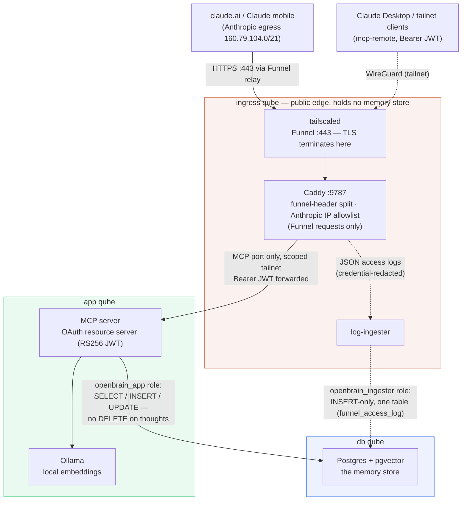
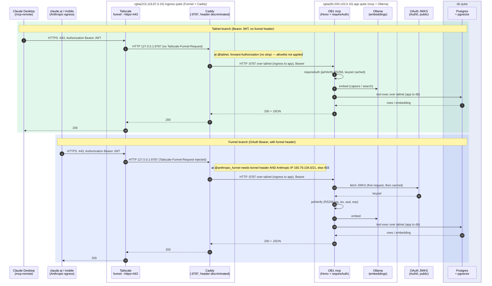
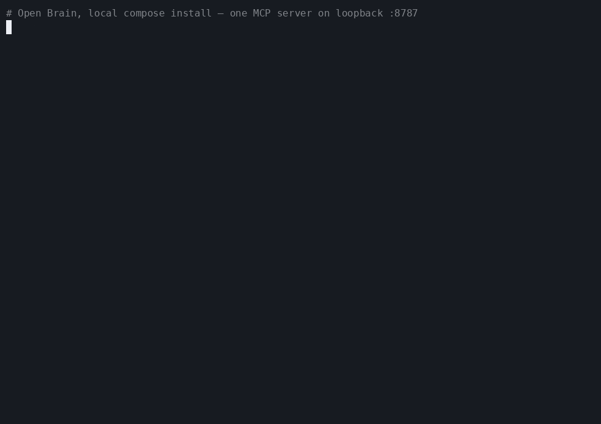
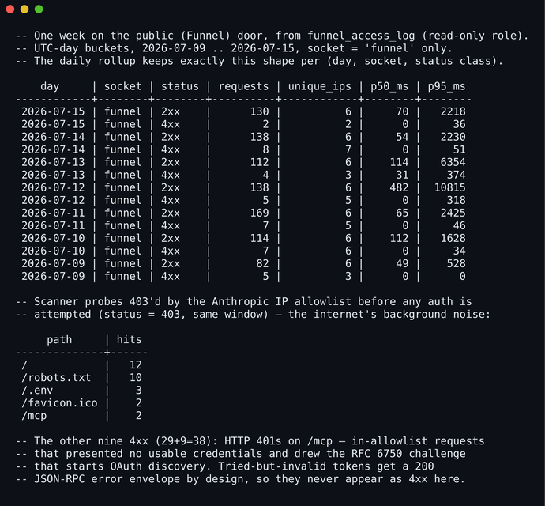

# Open Brain — Self-Hosted

[](https://github.com/lcjanke2020/ob1-selfhosted/actions/workflows/ci.yml)
[](https://github.com/lcjanke2020/ob1-selfhosted/actions/workflows/leak-gate.yml)
[](https://github.com/lcjanke2020/ob1-selfhosted/actions/workflows/allowlist-guard.yml)
[](https://github.com/lcjanke2020/ob1-selfhosted/actions/workflows/caddy-validate.yml)
[](https://github.com/lcjanke2020/ob1-selfhosted/actions/workflows/db-init.yml)

Self-hosted [Open Brain (OB1)](https://github.com/NateBJones-Projects/OB1): a persistent AI memory layer — Postgres + pgvector storage, local embeddings, one MCP server — that any MCP-aware AI client can read and write. No Supabase, no cloud, $0/month, your data never leaves hardware you own.

This repo is one codebase with **three install paths**, from "docker on a laptop" to "compartmentalized Qubes OS deployment with a hardened public edge":

| Install path | What you get | Start here |
|---|---|---|
| **Local compose** | Postgres + MCP server + Ollama on one box (bound to loopback only by default — the LAN can't reach it directly), simple shared `x-brain-key` auth (no Auth0 tenant needed). Runs anywhere Docker runs — including a work machine where a tailnet or hosted IdP isn't practical. | [`deploy/compose-local/`](deploy/compose-local/README.md) |
| **Tailnet / Funnel** | The same stack exposed to claude.ai and Claude mobile over the public internet via Tailscale Funnel + Caddy + OAuth (RS256 JWT) + an Anthropic egress IP allowlist. **OAuth is the only auth door** here — no static key on the public edge. | [`deploy/compose-tailnet/`](deploy/compose-tailnet/README.md) |
| **Qubes OS** | The stack split across ingress / app / database qubes, with the persistence and SELinux gotchas solved. Also OAuth-only, like the Funnel path. | [`deploy/qubes/`](deploy/qubes/README.md) |

> [!IMPORTANT]
> **The Tailnet / Funnel and Qubes OS paths need two external accounts before you start** (Local compose needs only Docker + Compose):
>
> - A **Tailscale account** — the free Personal plan is enough — with **Funnel enabled**: HTTPS certificates turned on for your tailnet and the `funnel` node attribute granted to the node. Pick a non-descriptive node name *before* enabling HTTPS — the hostname lands in public Certificate Transparency logs the moment the certificate is minted.
> - An **OAuth identity provider that issues RS256 JWTs** — the guides walk through a free **Auth0 tenant**, but any issuer with a JWKS endpoint works. You'll register one API whose identifier must equal your public MCP URL byte-for-byte (it's immutable — pick the hostname first) and one confidential application whose client id + secret you paste into claude.ai.
>
> The Funnel overlay also needs **Docker Compose v2.20+** (the `!reset` YAML tag); the Qubes path additionally assumes a working **Qubes OS** machine with Docker-capable templates.

## Architecture at a glance

The hardened shape (the **Qubes OS** install path). Each tinted box is a separate Qubes VM, connected over a firewall-scoped tailnet — a compromised public edge holds no memory store and no app credential. On the **Tailnet / Funnel** path the same components co-locate on one host over the local docker network — same OAuth door, minus the VM boundaries. **Local compose** is simpler still: just Postgres + the MCP server + Ollama behind the `x-brain-key` door, with no public edge at all.


```mermaid
flowchart TB
    CL["claude.ai / Claude mobile<br/>(Anthropic egress 160.79.104.0/21)"]
    CD["Claude Desktop / tailnet clients<br/>(mcp-remote, Bearer JWT)"]

    subgraph ING["ingress qube — public edge, holds no memory store"]
        TS["tailscaled<br/>Funnel :443 — TLS terminates here"]
        CA["Caddy :9787<br/>funnel-header split · Anthropic IP allowlist<br/>(Funnel requests only)"]
        LI["log-ingester"]
        TS --> CA
        CA -. "JSON access logs<br/>(credential-redacted)" .-> LI
    end

    subgraph APP["app qube"]
        MCP["MCP server<br/>OAuth resource server (RS256 JWT)"]
        OL["Ollama<br/>local embeddings"]
        MCP --> OL
    end

    subgraph DBQ["db qube"]
        PG["Postgres + pgvector<br/>the memory store"]
    end

    CL -- "HTTPS :443 via Funnel relay" --> TS
    CD -. "WireGuard (tailnet)" .-> TS
    CA -- "MCP port only, scoped tailnet<br/>Bearer JWT forwarded" --> MCP
    MCP -- "openbrain_app role:<br/>SELECT / INSERT / UPDATE —<br/>no DELETE on thoughts" --> PG
    LI -. "openbrain_ingester role:<br/>INSERT-only, one table (funnel_access_log)" .-> PG

    style ING fill:#d777571a,stroke:#d77757
    style APP fill:#3cc8781a,stroke:#3cc878
    style DBQ fill:#5082f01a,stroke:#5082f0
```

In text: clients reach tailscaled's single Funnel listener on the ingress qube; Caddy applies the funnel-header split (Pattern Y — tailnet clients hit the same listener) and the Anthropic IP allowlist, then proxies to the MCP server on the app qube, which embeds via Ollama and reads/writes Postgres on the db qube; the edge's log-ingester writes access-log rows to the db qube on an INSERT-only role. Design reasoning and the enforcement layers behind each arrow: [`three-qube-design.md`](deploy/qubes/three-qube-design.md). Request-level detail — both auth branches, step by step — is in [Request flow in detail](#request-flow-in-detail) below.

## What's in the box

- **`thoughts` memory** — capture, [hybrid vector + full-text search](docs/hybrid-search.md), listing, stats over a pgvector store. Reciprocal rank fusion (RRF) makes both semantic paraphrases and exact identifiers durable; dedupe is by content fingerprint. Optional LLM metadata extraction (topics, people, action items, type) via any OpenAI-compatible endpoint, plus a [versioned provenance contract](docs/thought-provenance.md) for caller-asserted author/agent/repo/branch context that stays visibly separate from server-verified transport identity. Both search legs can require or exclude those claims in the same call.
- **Fail-closed memory spaces** — thoughts and sessions carry a registered workspace, optional project, and `personal | project | workspace` visibility enforced by PostgreSQL RLS. Omitted scope selects one configured default, never every workspace. The seeded personal-only `sensitive` space is for particularly sensitive thoughts and work logs; see [Memory spaces](docs/spaces.md).
- **Session tracking** — five additional MCP tools (`session_capture`, `session_lookup`, `session_search`, `session_list`, `session_update_status`) that store structured *agent work sessions* alongside (not inside) `thoughts`. The OB1 Postgres `sessions` schema is the canonical store; TOML front matter is the interchange format accepted by `session_capture`. See [`skills/session-tracker/`](skills/session-tracker/SKILL.md) for the agent-facing usage contract.
- **REST gateway (`/api/v1`)** — the same thoughts + sessions operations as structured-JSON HTTP endpoints, behind the same auth doors, for CLI/cron/dashboard consumers that don't speak MCP. Opt-in per deployment (`ENABLE_REST_API`): on by default in the docker-compose installs, deliberately absent from the Qubes install, and never served over the public Funnel. See [REST API](#rest-api-apiv1) below.
- **Local embeddings** — Ollama (`nomic-embed-text`, 768-dim by default), in-stack or on another box.
- **Two auth modes, one per deployment** — a static `x-brain-key` header for the simple single-box local install (also usable over your tailnet if you front it with `tailscale serve`), or OAuth 2.1 resource-server validation (RS256 JWT via JWKS) as the single door on the publicly-reachable Funnel and Qubes deployments. The two doors are independently toggleable and the server refuses to boot with neither, so a public deployment carries no static key. Every write is stamped server-side with the door it came through.
- **Observability** — Caddy JSON access logs, an auth-failure audit table, a log-ingester sidecar, and a daily rollup with retention, so a public endpoint is *measured*, not guessed at.
- **Defense in depth** — loopback-only binds, dropped capabilities, read-only rootfs, least-privilege DB roles with a drift assertion, an Anthropic-egress IP allowlist at the proxy edge (the primary public perimeter, CI-guarded so it can't be silently dropped), credential redaction in access logs, fail-fast misconfiguration guards. The full inventory is in [`docs/security-model.md`](docs/security-model.md).

## Request flow in detail

The Tailnet/Funnel and Qubes deployments front the MCP server with Caddy + Tailscale Funnel and authenticate with OAuth (RS256 JWT) — the single auth door on any publicly-reachable install. Caddy's single `:9787` listener discriminates Funnel vs tailnet traffic via the `Tailscale-Funnel-Request` header that Tailscale injects only on funnel-originated requests (the single-listener design we call **Pattern Y**); that split scopes the Anthropic IP allowlist to public traffic and keeps the internal `/ready` probe off the public door — it no longer routes credentials, since both branches now carry the same Bearer JWT. (The local single-box install skips Caddy entirely and uses the simple `x-brain-key` door.)

> **Why Tailscale Funnel and not a Cloudflare Tunnel?** Cloudflare is a reasonable — for many people, better — choice; this project picks Funnel so TLS terminates on your own hardware (no edge with plaintext capability in the routine path) and so no vendor is added beyond the Tailscale account the private door already needs. The full trade-off, the honest caveats to that argument, and a sketch of the Cloudflare variant are in [`docs/why-not-cloudflare.md`](docs/why-not-cloudflare.md). A companion note, [`docs/why-local-only.md`](docs/why-local-only.md), covers the other axis — a hosted **connector** whose edge filter can *reject* a tool call, not just read it — and why executing MCP through a local runtime removes that hop.

On the [Qubes install path](deploy/qubes/README.md) these roles are split across **three qubes** — a Funnel + Caddy **ingress** qube, an **app** qube (mcp + Ollama), and a **db** qube (Postgres) — reached over a firewall-scoped tailnet ([three-qube-design.md](deploy/qubes/three-qube-design.md)) so that a compromised public edge need not expose the memory store, which lives in its own db qube. The sequence below traces a request through that topology; on a single host the same flow runs over the local docker network.


```mermaid
sequenceDiagram
    autonumber
    participant CD as Claude Desktop<br/>(mcp-remote)
    participant CL as claude.ai / mobile<br/>(Anthropic egress)
    box rgba(215,119,87,0.10) ingress qube (Funnel + Caddy)
        participant TS as Tailscale<br/>funnel --https=443
        participant CA as Caddy<br/>(:9787, header-discriminated)
    end
    box rgba(60,200,120,0.10) app qube (mcp + Ollama)
        participant OB as OB1 mcp<br/>(Hono + requireAuth)
        participant OL as Ollama<br/>(embeddings)
    end
    participant A0 as OAuth JWKS<br/>(Auth0, public)
    box rgba(80,130,240,0.10) db qube
        participant DB as Postgres<br/>+ pgvector
    end

    rect rgba(60, 200, 120, 0.15)
        Note over CD,DB: Tailnet branch (Bearer JWT, no funnel header)
        CD->>TS: HTTPS :443, Authorization Bearer JWT
        TS->>CA: HTTP 127.0.0.1:9787 (no Tailscale-Funnel-Request)
        Note right of CA: at @tailnet, forward Authorization (no strip) — allowlist not applied
        CA->>OB: HTTP :8787 over tailnet (ingress to app), Bearer
        OB->>OB: requireAuth (jwtVerify RS256, keyset cached)
        OB->>OL: embed (capture / search)
        OB->>DB: tool exec over tailnet (app to db)
        DB-->>OB: rows / embedding
        OB-->>CA: 200 + JSON
        CA-->>TS: 200
        TS-->>CD: 200
    end

    rect rgba(80, 130, 240, 0.15)
        Note over CL,DB: Funnel branch (OAuth Bearer, with funnel header)
        CL->>TS: HTTPS :443, Authorization Bearer JWT
        TS->>CA: HTTP 127.0.0.1:9787 (Tailscale-Funnel-Request injected)
        Note right of CA: at @anthropic_funnel needs funnel header AND Anthropic IP 160.79.104.0/21, else 403
        CA->>OB: HTTP :8787 over tailnet (ingress to app), Bearer
        OB->>A0: fetch JWKS (first request, then cached)
        A0-->>OB: keyset
        OB->>OB: jwtVerify (RS256 sig, iss, aud, exp)
        OB->>OL: embed
        OB->>DB: tool exec over tailnet (app to db)
        DB-->>OB: rows / embedding
        OB-->>CA: 200 + JSON
        CA-->>TS: 200
        TS-->>CL: 200
    end
```

## Repository layout

```
.
├── server/                    Deno + Hono server: MCP (11 tools) + REST gateway
│                              (/api/v1), unit tests, Dockerfiles for mcp and
│                              the log-ingester sidecar
├── db/                        Postgres init: roles, pgvector + lexical-search schema,
│                              observability, sessions, fail-closed spaces, grants
│                              assertion, daily rollup
├── deploy/
│   ├── compose-local/         Install path 1 — base docker-compose.yml + .env.example
│   ├── compose-tailnet/       Install path 2 — Pattern B overlay, Caddyfile, caddy image
│   └── qubes/                 Install path 3 — Qubes runbook + three-qube design doc
├── scripts/                   Daily observability summary, existing-deployment upgrades
├── skills/                    Agent-facing usage and testing procedures
│   ├── session-tracker/       How to use the session_* tools
│   ├── review-hybrid-search-fallbacks/
│   │                          Lexical fallback semantics and planner review
│   └── test-approximate-search-invariants/
│                              Stable CI boundaries for ANN search behavior
├── docs/                      Memory spaces, threat/security models, Funnel-as-MCP-
│                              perimeter guide, "why not Cloudflare?" rationale,
│                              Codex-over-OAuth client setup
└── .github/workflows/         CI (deno tests, --allow-env drift guard) + leak gate
```

The `queries.ts` / `mcp-server.ts` / `index.ts` split keeps all SQL in a pure, reusable module — that is what let the REST gateway below be added without rewriting database code, and a CLI or dashboard could follow the same path (shared validation in `schemas.ts`, shared orchestration in `services.ts`).

## REST API (`/api/v1`)

The same operations the MCP tools expose, as plain HTTP + JSON for consumers that don't speak MCP (shell scripts, cron jobs, dashboards). Same auth doors (`x-brain-key` header or OAuth Bearer), same validation bounds (including the 100 000-UTF-8-byte content cap), same orchestration code path — but responses are always structured JSON, never prose. Errors are `{"error": {"code", "message", "details"?}}` with conventional status codes (400 validation, 401 auth, 404 not found, 413 body over 1 MiB, 502 embedding backend down).

**Where it exists:** opt-in via `ENABLE_REST_API` (server default **off**). The docker-compose installs enable it; the Qubes install deliberately does not (its posture is minimum attack surface — when the flag is unset the router is never mounted, so the paths 404). On the Funnel deployment Caddy 404s `/api/v1*` on the public branch, so REST is reachable from the tailnet only.

| Method | Path | Body / query | Success |
|---|---|---|---|
| POST | `/api/v1/thoughts` | `{content, provenance?: {...}, scope?: {workspace_id?, project_id?, visibility?}}` | 201 `{id, metadata, workspace_id, project_id, visibility}` |
| POST | `/api/v1/thoughts/search` | `{query, limit?, threshold?, filter?: {...}, scope?: {...}}` | 200 `{results}` ordered by `rrf_score` (`similarity` retained) |
| GET | `/api/v1/thoughts` | `?limit&type&topic&person&days&workspace_id&project_id&visibility` | 200 `{thoughts}` |
| GET | `/api/v1/thoughts/stats` | `?workspace_id&project_id&visibility` | 200 stats |
| GET | `/api/v1/thoughts/:id` | UUID path param + optional scope query | 200 thought |
| POST | `/api/v1/sessions` | `{toml_text}` (session TOML) | 201 created / 200 updated |
| POST | `/api/v1/sessions/search` | `{query, limit?, status?, repo_url?, tag?, scope?: {...}}` | 200 `{results}` |
| GET | `/api/v1/sessions` | filters plus optional `workspace_id`, `project_id`, `visibility` | 200 `{sessions}` |
| GET | `/api/v1/sessions/lookup` | `?id` or `?branch`, plus optional scope | 200 session record |
| GET | `/api/v1/sessions/:id` | integer path param + optional scope query | 200 session record |
| PATCH | `/api/v1/sessions/:id/status` | `{status, scope?: {...}}` | 200 `{id, status}` |

Notes: thought capture upserts by content fingerprint, so re-posting identical
content returns the existing id (still 201) only inside the same exact audience.
POST/PATCH bodies use a nested `scope`; GET routes use the three flat query
parameters. Omitted scope selects `DEFAULT_WORKSPACE_ID`, never all workspaces.
The complete union, principal, and seeded `sensitive` semantics are in
[Memory spaces](docs/spaces.md).

Compatibility note for server 1.9.0: REST request bodies and query envelopes
are strict. Extra fields that older versions silently ignored now return 400.
Session TOML is strict too and rejects the retired `ingested_path` and
`needs_file_sync` fields; use structured session lookup plus live context when
building a refresh, never an old raw TOML document. After upgrading, reconnect
or restart every MCP client/connector so it fetches the 1.9.0 tool schemas with
their new scope fields.

Session capture mirrors `session_capture`: omit `id` in the TOML to create
(201), or include it to refresh the same row (200); `title` remains required on
a refresh. An unknown `id` is a 404, and an unchanged content hash skips the
re-embed (`reembedded: false` in the response). A refresh replaces the
authorable document and artifact set: apart from omit-preserved `session_id`
and `status`, omitted optional scalars become null, omitted arrays become empty,
and omitting all `[[artifacts]]` blocks removes stored artifacts. Full records
returned by `/api/v1/sessions/lookup` and `/api/v1/sessions/:id` include
`raw_toml`, the historical input from the last capture; current structured
fields are authoritative, so build refresh TOML fresh from those fields and
live context.

No CORS headers are served — intended consumers are server-side (curl, scripts,
cron, backends); a browser-based cross-origin dashboard would need its own
CORS-terminating layer in front.

```sh
curl -s -X POST http://127.0.0.1:8787/api/v1/thoughts \
  -H "x-brain-key: $MCP_ACCESS_KEY" -H "content-type: application/json" \
  -d '{"content":"REST smoke test","provenance":{"author":"release engineering","agent":"codex","repo":"example/open-brain","branch":"main"}}'
# → {"id":"…","metadata":{…,"source":"rest","door":"tailnet","sub":null,
#      "provenance":{"schema_version":1,"caller_asserted":{"author":"release engineering",…}}}}

curl -s -X POST http://127.0.0.1:8787/api/v1/thoughts/search \
  -H "x-brain-key: $MCP_ACCESS_KEY" -H "content-type: application/json" \
  -d '{"query":"REST rollout","filter":{"include":{"repo":"example/open-brain"},"exclude":{"author":"release engineering","agent":"codex"}}}'
# → hybrid semantic/exact-text matches from that repo, excluding rows whose author OR agent matches
```

With `MCP_ACCESS_KEY_PRINCIPAL` configured on a local shared-key deployment, a
particularly sensitive capture is explicit and personal:

```sh
curl -s -X POST http://127.0.0.1:8787/api/v1/thoughts \
  -H "x-brain-key: $MCP_ACCESS_KEY" -H "content-type: application/json" \
  -d '{"content":"A particularly sensitive thought","scope":{"workspace_id":"sensitive","visibility":"personal"}}'
```

`source`, `door`, and `sub` are stamped by the server. Values under
`provenance.caller_asserted` are explicit claims from the authenticated caller,
validated but not independently verified; omit unknown values rather than guessing.
The full key schema, search-filter semantics, compatibility behavior, and
agent-caller guidance are in [Thought provenance](docs/thought-provenance.md).

## Quickstart

The five-minute version (full guide in [`deploy/compose-local/`](deploy/compose-local/README.md)):

```bash
git clone https://github.com/lcjanke2020/ob1-selfhosted.git
cd ob1-selfhosted/deploy/compose-local
cp .env.example .env       # then fill in the four secrets (openssl rand -hex 24/32)
docker compose up -d ollama
docker compose exec ollama ollama pull nomic-embed-text
docker compose up -d
curl http://127.0.0.1:8787/health
```

Then point any MCP client at `http://127.0.0.1:8787/mcp` with your `x-brain-key`.

## See it working

Capture a thought, find it again by meaning, checkpoint an agent work session, and resume it by branch — against a local compose install, driven with a tiny shell helper around `curl` and `jq` (the `mcp()` function shown in the recording is just `curl … | jq`, with the endpoint and key taken from `$BRAIN` and `$BRAIN_KEY`). The recording demonstrates the vector leg; exact-text recall now joins it through [hybrid RRF search](docs/hybrid-search.md):



*(The recording is also committed as [`docs/assets/demo.cast`](docs/assets/demo.cast) for `asciinema play` — it's asciicast v3, so it needs asciinema ≥ 3.0.)*

And what the observability stack is for — one week of real data from a live deployment's public Funnel door (UTC-day buckets): every request bucketed by day and status class, the internet's background scanning (`/.env` probes and friends) rejected `403` by the Anthropic IP allowlist before auth is ever attempted, and the handful of in-allowlist requests that presented no usable credentials and drew the `401` challenge that starts OAuth discovery (in the recorded week, tried-but-invalid tokens were answered with a `200` JSON-RPC error envelope, so they don't appear as 4xx; every auth rejection now returns a transport-level `401` per the MCP authorization spec):



## Trust model, in one paragraph

On the **local single-box install**, anyone who can present your `x-brain-key` (loopback, your LAN, or your tailnet if you front it with `tailscale serve`) enters the same shared-key trust boundary — treat the key like a database password. Personal spaces are disabled on that door unless the operator deliberately binds it to one deployment-wide `MCP_ACCESS_KEY_PRINCIPAL`. On any **Funnel or Qubes** deployment there is no static key at all: a valid RS256 JWT supplies a verified `sub`, and PostgreSQL RLS partitions personal rows by that subject while workspace/project rows follow the requested registered scope. The Anthropic-egress IP allowlist still restricts the public door before auth. Thought `author` / `agent` / `repo` / `branch` provenance remains a caller assertion, not authenticated identity. The longer version is in [`docs/security-model.md`](docs/security-model.md), with the scope contract in [`docs/spaces.md`](docs/spaces.md).

## Status & roadmap

- All three install paths describe deployments that are running today; the test suite (`cd server && deno task test`) is hermetic and runs in CI.
- The Qubes install path runs as the **three-qube split**, each role in its own self-contained per-qube compose directory ([`deploy/qubes/db-qube/`](deploy/qubes/db-qube/), [`app-qube/`](deploy/qubes/app-qube/), [`ingress-qube/`](deploy/qubes/ingress-qube/) — see [`three-qube-design.md`](deploy/qubes/three-qube-design.md)): Postgres in its own db qube; the app (mcp + Ollama) plus the encrypted off-box backup in an app qube; Funnel + Caddy + the log-ingester in an ingress qube that reverse-proxies to the app qube across a firewall-scoped tailnet. The ingress qube no longer starts the app containers ([#13](https://github.com/lcjanke2020/ob1-selfhosted/issues/13)) — its compose defines only Caddy + the log-ingester. The log-ingester writes its access-log rows across to the db qube for now, with a parked local logs store on the ingress qube as its documented future home ([#12](https://github.com/lcjanke2020/ob1-selfhosted/issues/12)).

## Contributing

Contributions are welcome — [`docs/why-not-cloudflare.md`](docs/why-not-cloudflare.md) even sketches a `deploy/compose-cloudflare/` variant waiting to be built. Start with [CONTRIBUTING.md](CONTRIBUTING.md); the one non-negotiable is enabling the local leak guard first (`git config core.hooksPath .githooks`) — this is a public repo and CI blocks anything that looks like a credential or private-infrastructure identifier.

## License & attribution

This project is a self-hosted derivative of [Open Brain (OB1)](https://github.com/NateBJones-Projects/OB1) by Nate B. Jones. It began as a private working fork of OB1 (the *OB1-homelab* line, since retired) and deliberately keeps a smaller footprint than upstream — no web dashboard, no Supabase, just the memory layer and its perimeter. It is licensed under the same **FSL-1.1-MIT** terms (see [LICENSE.md](LICENSE.md)): free for any non-competing use, converting to MIT two years after release. The `thoughts` table layout stays compatible with upstream OB1, so schema extensions from that community work here too.

[MihaiBuilds/memory-vault](https://github.com/MihaiBuilds/memory-vault) was also
inspirational to this project's memory-spaces work and parts of its search
improvements. That design influence is gratefully acknowledged; the
fail-closed RLS and hybrid-search implementation here was written for Open
Brain's own contract and deployment model.
